# MATF42 - Processamento Massivo Paralelo

## Tutorial Docker + Jupyter + Scala no Windows

### Grupo: Diego Cunha, Gilson Ramos, Gregori Sena, Luiz Pita e Taian Feitosa

# Requisitos para o Tutorial

Sua máquina Windows deve atender aos seguintes requisitos para instalar o Docker Desktop com êxito:

### Utilizando WSL 2 backend

* Windows 11 64-bit: Pro versão 21H2 ou superior, ou Enterprise ou Education verssão 21H2 ou superior.
* Windows 10 64-bit: Home ou Pro 21H1 (build 19043) ou superior, ou Enterprise ou Education 20H2 (build 19042) ou superior.
* Habilitado o recurso WSL 2 no Windows. Para obter instruções detalhadas,
  consulte [Microsoft documentation](https://docs.microsoft.com/en-us/windows/wsl/install).
* Os seguintes pré-requisitos de hardware são necessários para executar com êxito o WSL 2 no Windows 10 ou Windows 11:
    - processador 64-bit com Tradução de Endereço de segundo nível (SLAT)
    - 4GB RAM
    - Suporte à virtualização de hardware no nível da BIOS, deve ser ativado nas configurações da BIOS. Para mais
      informações
      acesse [Virtualization](https://docs.docker.com/desktop/windows/troubleshoot/#virtualization-must-be-enabled).
* Baixar e instalar
  o [Linux kernel update package](https://docs.microsoft.com/pt-br/windows/wsl/install-manual#step-4---download-the-linux-kernel-update-package)
  .

### Utilizando  Hyper-V backend and Windows containers

* Windows 11 64-bit: Pro versão 21H2 ou superior, ou Enterprise ou Education verssão 21H2 ou superior.
* Windows 10 64-bit: Home ou Pro 21H1 (build 19043) ou superior, ou Enterprise ou Education 20H2 (build 19042) ou
  superior.

Para Windows 10 e Windows 11 Home, consulte os requisitos de sistema no **WSL 2 backend**.

* Os recursos do Hyper-V e Containers Windows devem estar habilitados.
* Os seguintes pré-requisitos de hardware são necessários para executar com êxito o Client Hyper-V no Windows 10:
    - processador 64-bit com Tradução de Endereço de segundo nível (SLAT)
    - 4GB RAM
    - Suporte à virtualização de hardware no nível da BIOS, deve ser ativado nas configurações da BIOS. Para mais
      informações
      acesse [Virtualization](https://docs.docker.com/desktop/windows/troubleshoot/#virtualization-must-be-enabled).

# Passo 1

Faça do download do Docker Desktop em:

- https://docs.docker.com/desktop/windows/install/

Clicando no link acima será iniciado o download do arquivo **Docker Desktop Installer.exe**, após o fim do download do
arquivo execute-o para dá inicio a instalação.

# Passo 2

Após iniciar a instalação do Docker será exibido a tela abaixo, clique em **OK** para dá inicio ao processo de
instalação.

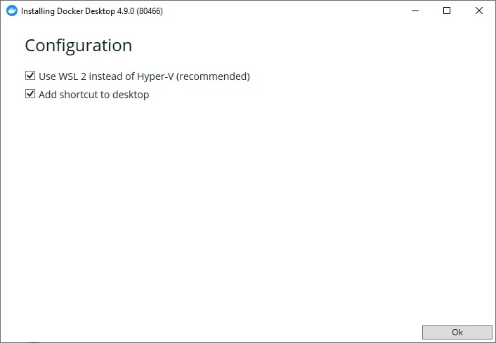

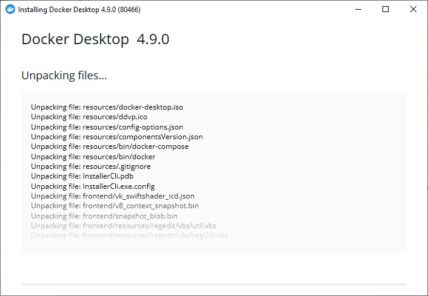

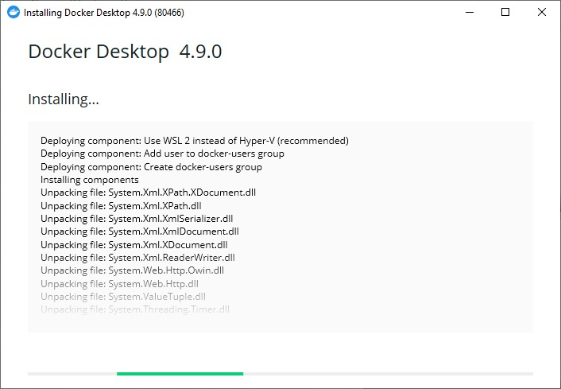

Clique no botão **Close and restart** para reiniciar o Windows e completar a instalação do Docker.

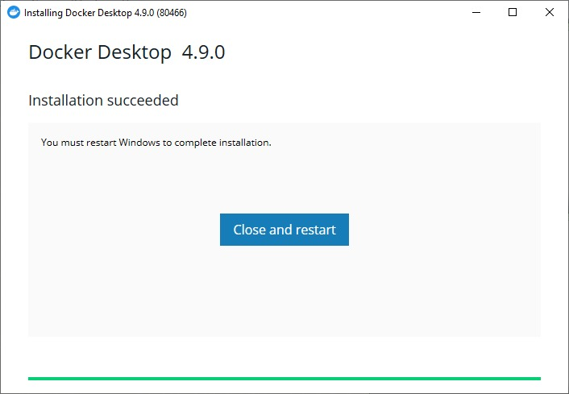

Na tela seguinte é preciso aceitar os termos selecionando a opção **I accept the terms** e clicar no botão **Accept**.


Após esse passo teremos nosso Docker Desktop instalado.

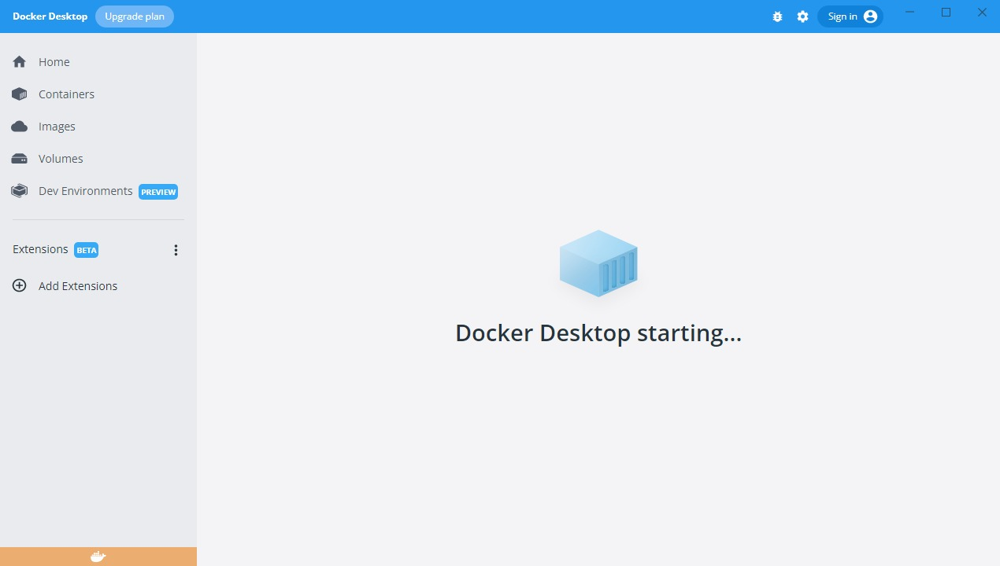

Após o Docker instalado, é necessário reiniciar o Windows.

# Passo 3

Após a instalação o Docker Desktop solicitará a instalação do WSL 2, caso você já tenha o WSL 2 instalado não será solicitado a instalação e você pode pular para o [Passo 4](#passo-4).

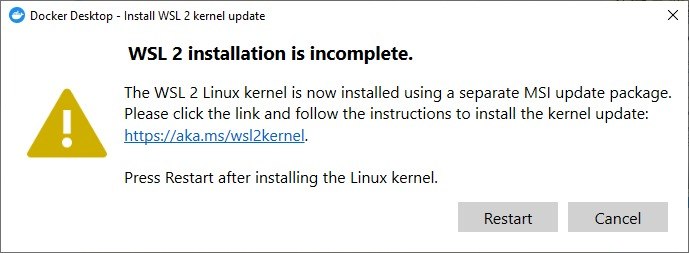

Basta clicar sempre em **Next** para proseguir com a instalação e ao final clicar em **Finish**.

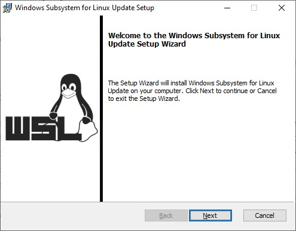

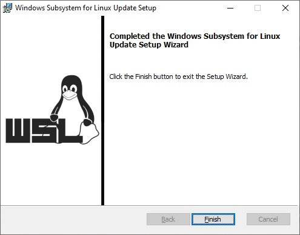

Após o Docker Desktop instalado, para testar se tudo ocorreu bem abra o terminal do Windows e execute o comando abaixo:

<code>docker run -d -p 80:80 docker/getting-started</code>

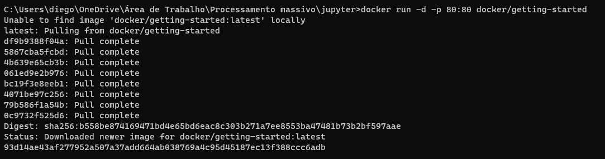

Após o finalizar o processo no terminal abra o navegador com o <a href="http://localhost" target="_blank">link</a>, a imagem abaixo deve ser apresentada.

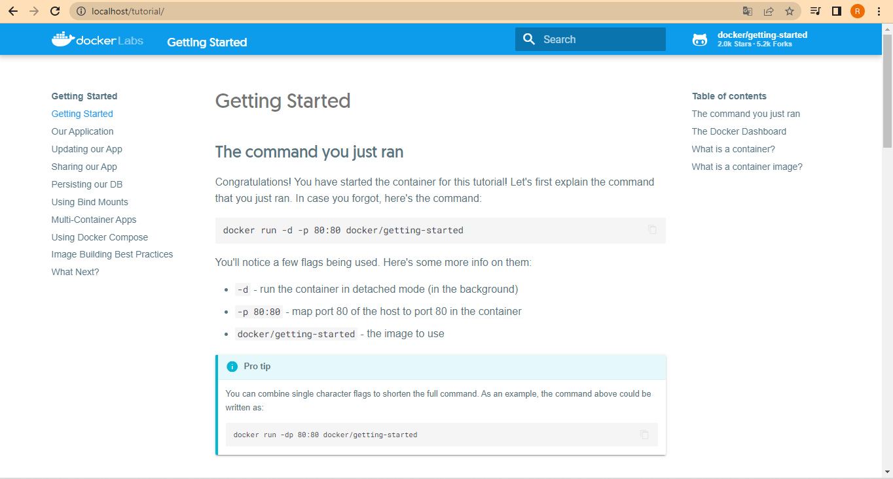

Caso tudo ocorra bem será apresentada a página **Getting Started** do Docker.
Agora precisamos parar o container usado para teste com os comando abaixo.

Para verificar os container que está rodando execute o comando abaixo e pegue o **CONTAINER ID**.

<code>docker ps</code>

Com o conteiner id em mãos execute o comando abaixo para parar a execução do container.

<code>docker stop CONTAIER_ID</code>

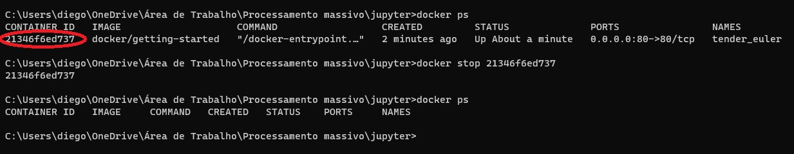

# Passo 4

### Configuração do ambiente com o Docker Compose.

Para iniciar precisamos acessar o link no github do projeto, para baixar os arquivos necessarios para a execução do tutorial. <a href="https://github.com/taianf/MATF42-Trabalho" target="_blank">Clique aqui</a> para acessar o repositório.

Caso você tenha o git instalado você pode fazer o download do repositório executando o seguinte comando.

~~~
git clone https://github.com/taianf/MATF42-Trabalho.git
~~~

Caso não tenha o git instalado você pode clicar no botão **Code** e logo em seguida clicar em **Donwload ZIP** para baixar os arquivos compactados e descompacta-los em uma pasta, como podemos ver na imagem abaixo.

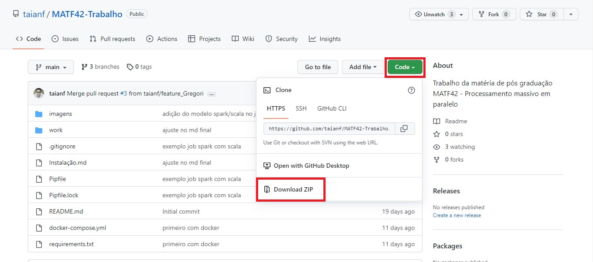

Após o download você deve acessar a pasta do projeto e vai perceber que existe o arquivo **docker-compose.yml** com o seguite conteúdo.

~~~
version: '3'
services:
  jupyter-notebook:
    image: jupyter/all-spark-notebook
    ports:
      - "8888:8888"
      - "4040:4040"
    volumes:
      - ./work/:/home/jovyan/work
~~~

Docker Compose é o orquestrador de containers da Docker, é escrito em YAML (acrônimo recursivo para YAML Ain’t Markup
Language) é um formato de codificação de dados legíveis por humanos, o que torna fácil de ler e entender o que um
Compose faz!

No nosso caso, estamos rodando o Jupyter dentro de um container, então no nosso docker compose, configuramos o endereço
da imagem, a informação das portas e volume da nossa imagem.

Aqui nesse tutorial utilizaremos a imagem docker **jupyter/all-spark-notebook**, que é uma imagem contendo já instalado e configurando um ambiente com o Jupyter Notebook Python, Scala, R, Spark e outras ferramentas.

Após o Docker Desktop baixado e o compose configurado, vamos até a pasta onde está nosso arquivo do docker-compose abrimos o terminal e
executamos o seguinte comando:

<code>docker-compose up</code>

Com esse comando baixamos a imagem do jupyter e inicializamos nosso container, após isso conseguimos acessar nosso
ambiente já dentro do container através do link que é apresentado no fim lá do terminal.

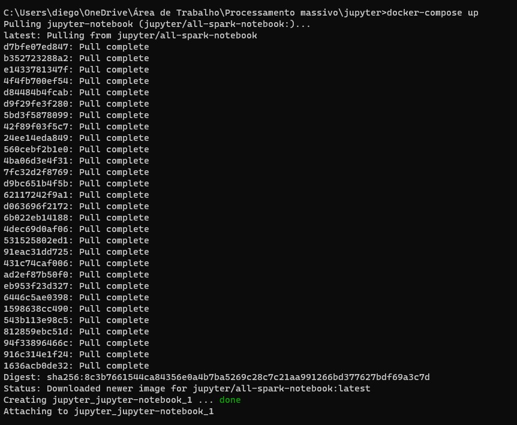

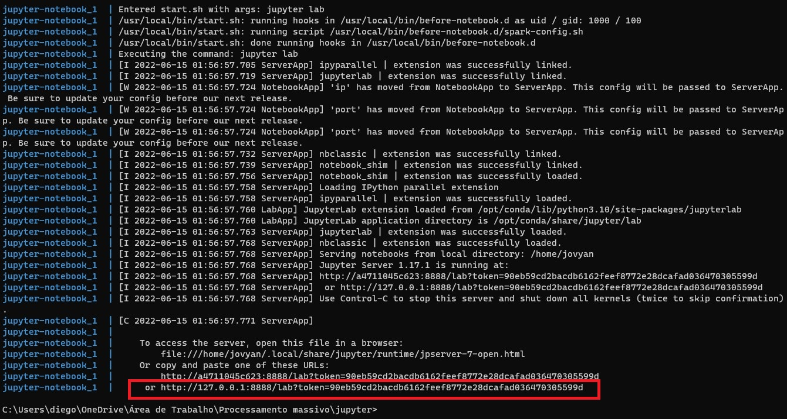

Acessando o link acima teremos a seguinte página do Jupyter.

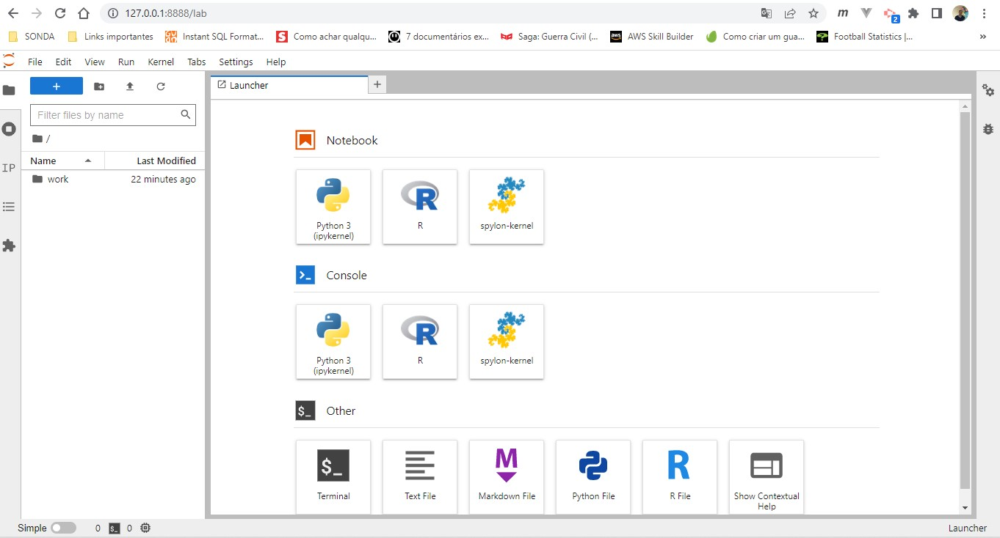

# Passo 5

## Exemplo de Notebook Jupyter com Spark e Scala

Este notebook tem um exemplo de aplicação Spark feita em Scala no notebook jupyter com o kernel spylon através da imagem docker jupyter/all-spark-notebook. Para mais detalhes, ver o arquivo de instalação presente neste repositório.

Esta aplicação irá gerar um modelo de floresta aleatória para prever o time vencedor em uma partida de League of Legends.
Os dados são obtidos através da API oficial da Riot Games, e foram compilados no kaggle neste [link](https://www.kaggle.com/datasets/datasnaek/league-of-legends) pelo usuário [Mitchel J](https://www.kaggle.com/datasnaek).

O notebook apresentado abaixo se encontra dentro do diretório **work/scala.ipynb**. Você abrir o notebook no jupyter ou se preferir pode criar um novo notebook **spylon-kernel** e ir copiando o código apresentado abaixo. 

## Importar as bibliotecas necessárias

```scala
import org.apache.spark.ml.Pipeline
import org.apache.spark.ml.classification.RandomForestClassifier
import org.apache.spark.ml.evaluation.BinaryClassificationEvaluator
import org.apache.spark.ml.feature._
import org.apache.spark.ml.tuning._
import org.apache.spark.sql.SparkSession
```
### Resultado do código executado:


    Intitializing Scala interpreter ...


    Spark Web UI available at http://8c62f2285646:4040
    SparkContext available as 'sc' (version = 3.2.1, master = local[*], app id = local-1655330486187)
    SparkSession available as 'spark'


    import org.apache.spark.ml.Pipeline
    import org.apache.spark.ml.classification.RandomForestClassifier
    import org.apache.spark.ml.evaluation.BinaryClassificationEvaluator
    import org.apache.spark.ml.feature._
    import org.apache.spark.ml.tuning._
    import org.apache.spark.sql.SparkSession


## Definir a SparkSession


```scala
// Para definir um cluster externo master,
// basta trocar "local[*]" por "spark://<host>:<port>"
// com os dados de host e port do master.
val spark = SparkSession.builder.master("local[*]").getOrCreate
```


### Resultado do código executado:

    spark: org.apache.spark.sql.SparkSession = org.apache.spark.sql.SparkSession@56d90cfa


## Carregar dados dos jogos

Caso tenha criado um novo notebook é importante observar a linha **.csv("games.csv")**, que é onde vamos carregar nosso arquivo. Então caso seu arquivo tenha sido criado fora da pasta **work** é importante alterar essa linha para que o arquivo csv seja carregado corretamente.

```scala
val gamesDF = spark.read
  .option("header", value = true)
  .option("inferSchema", value = true)
  .csv("games.csv")
  .persist()
```


### Resultado do código executado:

    gamesDF: org.apache.spark.sql.Dataset[org.apache.spark.sql.Row] = [gameId: bigint, creationTime: bigint ... 59 more fields]


## Analisar schema e dados no dataframe


```scala
gamesDF.printSchema
```

### Resultado do comando executado:


    root
     |-- gameId: long (nullable = true)
     |-- creationTime: long (nullable = true)
     |-- gameDuration: integer (nullable = true)
     |-- seasonId: integer (nullable = true)
     |-- winner: integer (nullable = true)
     |-- firstBlood: integer (nullable = true)
     |-- firstTower: integer (nullable = true)
     |-- firstInhibitor: integer (nullable = true)
     |-- firstBaron: integer (nullable = true)
     |-- firstDragon: integer (nullable = true)
     |-- firstRiftHerald: integer (nullable = true)
     |-- t1_champ1id: integer (nullable = true)
     |-- t1_champ1_sum1: integer (nullable = true)
     |-- t1_champ1_sum2: integer (nullable = true)
     |-- t1_champ2id: integer (nullable = true)
     |-- t1_champ2_sum1: integer (nullable = true)
     |-- t1_champ2_sum2: integer (nullable = true)
     |-- t1_champ3id: integer (nullable = true)
     |-- t1_champ3_sum1: integer (nullable = true)
     |-- t1_champ3_sum2: integer (nullable = true)
     |-- t1_champ4id: integer (nullable = true)
     |-- t1_champ4_sum1: integer (nullable = true)
     |-- t1_champ4_sum2: integer (nullable = true)
     |-- t1_champ5id: integer (nullable = true)
     |-- t1_champ5_sum1: integer (nullable = true)
     |-- t1_champ5_sum2: integer (nullable = true)
     |-- t1_towerKills: integer (nullable = true)
     |-- t1_inhibitorKills: integer (nullable = true)
     |-- t1_baronKills: integer (nullable = true)
     |-- t1_dragonKills: integer (nullable = true)
     |-- t1_riftHeraldKills: integer (nullable = true)
     |-- t1_ban1: integer (nullable = true)
     |-- t1_ban2: integer (nullable = true)
     |-- t1_ban3: integer (nullable = true)
     |-- t1_ban4: integer (nullable = true)
     |-- t1_ban5: integer (nullable = true)
     |-- t2_champ1id: integer (nullable = true)
     |-- t2_champ1_sum1: integer (nullable = true)
     |-- t2_champ1_sum2: integer (nullable = true)
     |-- t2_champ2id: integer (nullable = true)
     |-- t2_champ2_sum1: integer (nullable = true)
     |-- t2_champ2_sum2: integer (nullable = true)
     |-- t2_champ3id: integer (nullable = true)
     |-- t2_champ3_sum1: integer (nullable = true)
     |-- t2_champ3_sum2: integer (nullable = true)
     |-- t2_champ4id: integer (nullable = true)
     |-- t2_champ4_sum1: integer (nullable = true)
     |-- t2_champ4_sum2: integer (nullable = true)
     |-- t2_champ5id: integer (nullable = true)
     |-- t2_champ5_sum1: integer (nullable = true)
     |-- t2_champ5_sum2: integer (nullable = true)
     |-- t2_towerKills: integer (nullable = true)
     |-- t2_inhibitorKills: integer (nullable = true)
     |-- t2_baronKills: integer (nullable = true)
     |-- t2_dragonKills: integer (nullable = true)
     |-- t2_riftHeraldKills: integer (nullable = true)
     |-- t2_ban1: integer (nullable = true)
     |-- t2_ban2: integer (nullable = true)
     |-- t2_ban3: integer (nullable = true)
     |-- t2_ban4: integer (nullable = true)
     |-- t2_ban5: integer (nullable = true)
    


### Comando para visualizar os 5 primeiros registros:

```scala
gamesDF.show(5)
```
### Resultado do comando executado:

    +----------+-------------+------------+--------+------+----------+----------+--------------+----------+-----------+---------------+-----------+--------------+--------------+-----------+--------------+--------------+-----------+--------------+--------------+-----------+--------------+--------------+-----------+--------------+--------------+-------------+-----------------+-------------+--------------+------------------+-------+-------+-------+-------+-------+-----------+--------------+--------------+-----------+--------------+--------------+-----------+--------------+--------------+-----------+--------------+--------------+-----------+--------------+--------------+-------------+-----------------+-------------+--------------+------------------+-------+-------+-------+-------+-------+
    |    gameId| creationTime|gameDuration|seasonId|winner|firstBlood|firstTower|firstInhibitor|firstBaron|firstDragon|firstRiftHerald|t1_champ1id|t1_champ1_sum1|t1_champ1_sum2|t1_champ2id|t1_champ2_sum1|t1_champ2_sum2|t1_champ3id|t1_champ3_sum1|t1_champ3_sum2|t1_champ4id|t1_champ4_sum1|t1_champ4_sum2|t1_champ5id|t1_champ5_sum1|t1_champ5_sum2|t1_towerKills|t1_inhibitorKills|t1_baronKills|t1_dragonKills|t1_riftHeraldKills|t1_ban1|t1_ban2|t1_ban3|t1_ban4|t1_ban5|t2_champ1id|t2_champ1_sum1|t2_champ1_sum2|t2_champ2id|t2_champ2_sum1|t2_champ2_sum2|t2_champ3id|t2_champ3_sum1|t2_champ3_sum2|t2_champ4id|t2_champ4_sum1|t2_champ4_sum2|t2_champ5id|t2_champ5_sum1|t2_champ5_sum2|t2_towerKills|t2_inhibitorKills|t2_baronKills|t2_dragonKills|t2_riftHeraldKills|t2_ban1|t2_ban2|t2_ban3|t2_ban4|t2_ban5|
    +----------+-------------+------------+--------+------+----------+----------+--------------+----------+-----------+---------------+-----------+--------------+--------------+-----------+--------------+--------------+-----------+--------------+--------------+-----------+--------------+--------------+-----------+--------------+--------------+-------------+-----------------+-------------+--------------+------------------+-------+-------+-------+-------+-------+-----------+--------------+--------------+-----------+--------------+--------------+-----------+--------------+--------------+-----------+--------------+--------------+-----------+--------------+--------------+-------------+-----------------+-------------+--------------+------------------+-------+-------+-------+-------+-------+
    |3326086514|1504279457970|        1949|       9|     1|         2|         1|             1|         1|          1|              2|          8|            12|             4|        432|             3|             4|         96|             4|             7|         11|            11|             6|        112|             4|            14|           11|                1|            2|             3|                 0|     92|     40|     69|    119|    141|        104|            11|             4|        498|             4|             7|        122|             6|             4|        238|            14|             4|        412|             4|             3|            5|                0|            0|             1|                 1|    114|     67|     43|     16|     51|
    |3229566029|1497848803862|        1851|       9|     1|         1|         1|             1|         0|          1|              1|        119|             7|             4|         39|            12|             4|         76|             4|             3|         10|             4|            14|         35|             4|            11|           10|                4|            0|             2|                 1|     51|    122|     17|    498|     19|         54|             4|            12|         25|             4|            14|        120|            11|             4|        157|             4|            14|         92|             4|             7|            2|                0|            0|             0|                 0|     11|     67|    238|     51|    420|
    |3327363504|1504360103310|        1493|       9|     1|         2|         1|             1|         1|          2|              0|         18|             4|             7|        141|            11|             4|        267|             3|             4|         68|             4|            12|         38|            12|             4|            8|                1|            1|             1|                 0|    117|     40|     29|     16|     53|         69|             4|             7|        412|            14|             4|        126|             4|            12|         24|             4|            11|         22|             7|             4|            2|                0|            0|             1|                 0|    157|    238|    121|     57|     28|
    |3326856598|1504348503996|        1758|       9|     1|         1|         1|             1|         1|          1|              0|         57|             4|            12|         63|             4|            14|         29|             4|             7|         61|             4|             1|         36|            11|             4|            9|                2|            1|             2|                 0|    238|     67|    516|    114|     31|         90|            14|             4|         19|            11|             4|        412|             4|             3|         92|             4|            14|         22|             4|             7|            0|                0|            0|             0|                 0|    164|     18|    141|     40|     51|
    |3330080762|1504554410899|        2094|       9|     1|         2|         1|             1|         1|          1|              0|         19|             4|            12|         29|            11|             4|         40|             4|             3|        119|             4|             7|        134|             7|             4|            9|                2|            1|             3|                 0|     90|     64|    412|     25|     31|         37|             3|             4|         59|             4|            12|        141|            11|             4|         38|             4|            12|         51|             4|             7|            3|                0|            0|             1|                 0|     86|     11|    201|    122|     18|
    +----------+-------------+------------+--------+------+----------+----------+--------------+----------+-----------+---------------+-----------+--------------+--------------+-----------+--------------+--------------+-----------+--------------+--------------+-----------+--------------+--------------+-----------+--------------+--------------+-------------+-----------------+-------------+--------------+------------------+-------+-------+-------+-------+-------+-----------+--------------+--------------+-----------+--------------+--------------+-----------+--------------+--------------+-----------+--------------+--------------+-----------+--------------+--------------+-------------+-----------------+-------------+--------------+------------------+-------+-------+-------+-------+-------+
    only showing top 5 rows
    


## Separar em dados de treino e teste


```scala
val seed = 11011990
val Array(dataTrain, dataTest) = gamesDF.randomSplit(Array(0.8, 0.2), seed)
```


### Resultado do código executado:

    seed: Int = 11011990
    dataTrain: org.apache.spark.sql.Dataset[org.apache.spark.sql.Row] = [gameId: bigint, creationTime: bigint ... 59 more fields]
    dataTest: org.apache.spark.sql.Dataset[org.apache.spark.sql.Row] = [gameId: bigint, creationTime: bigint ... 59 more fields]


## Filtrar colunas relevantes ao modelo


```scala
val columns = gamesDF.columns.filter(
  !Array("gameId", "creationTime", "seasonId", "winner").contains(_)
)
```


### Resultado do código executado:

    columns: Array[String] = Array(gameDuration, firstBlood, firstTower, firstInhibitor, firstBaron, firstDragon, firstRiftHerald, t1_champ1id, t1_champ1_sum1, t1_champ1_sum2, t1_champ2id, t1_champ2_sum1, t1_champ2_sum2, t1_champ3id, t1_champ3_sum1, t1_champ3_sum2, t1_champ4id, t1_champ4_sum1, t1_champ4_sum2, t1_champ5id, t1_champ5_sum1, t1_champ5_sum2, t1_towerKills, t1_inhibitorKills, t1_baronKills, t1_dragonKills, t1_riftHeraldKills, t1_ban1, t1_ban2, t1_ban3, t1_ban4, t1_ban5, t2_champ1id, t2_champ1_sum1, t2_champ1_sum2, t2_champ2id, t2_champ2_sum1, t2_champ2_sum2, t2_champ3id, t2_champ3_sum1, t2_champ3_sum2, t2_champ4id, t2_champ4_sum1, t2_champ4_sum2, t2_champ5id, t2_champ5_sum1, t2_champ5_sum2, t2_towerKills, t2_inhibitorKills, t2_baronKills, t2_dragonKills, t2_riftHeraldKills, t2_ba...


## Gerar assembler para criar vetor de features com as colunas desejadas


```scala
val assembler = new VectorAssembler()
  .setInputCols(columns)
  .setOutputCol("features")
```

### Resultado do código executado:

    assembler: org.apache.spark.ml.feature.VectorAssembler = VectorAssembler: uid=vecAssembler_580d5cfb8808, handleInvalid=error, numInputCols=57


## Indexador para definir a coluna interesse


```scala
val indexer = new StringIndexer()
  .setInputCol("winner")
  .setOutputCol("label")
```


### Resultado do código executado:

    indexer: org.apache.spark.ml.feature.StringIndexer = strIdx_819a9a0ec61e


## Definindo o classificador de Floresta Aleatória


```scala
val randomForestClassifier = new RandomForestClassifier()
  .setImpurity("gini")
  .setMaxDepth(3)
  .setNumTrees(20)
  .setFeatureSubsetStrategy("auto")
```


### Resultado do código executado:

    randomForestClassifier: org.apache.spark.ml.classification.RandomForestClassifier = rfc_e715460b59df


## Definindo o pipeline de operações


```scala
val stages = Array(assembler, indexer, randomForestClassifier)
val pipeline = new Pipeline().setStages(stages)
```


### Resultado do código executado:

    stages: Array[org.apache.spark.ml.PipelineStage with org.apache.spark.ml.util.DefaultParamsWritable{def copy(extra: org.apache.spark.ml.param.ParamMap): org.apache.spark.ml.PipelineStage with org.apache.spark.ml.util.DefaultParamsWritable{def copy(extra: org.apache.spark.ml.param.ParamMap): org.apache.spark.ml.PipelineStage with org.apache.spark.ml.util.DefaultParamsWritable}}] = Array(VectorAssembler: uid=vecAssembler_580d5cfb8808, handleInvalid=error, numInputCols=57, strIdx_819a9a0ec61e, rfc_e715460b59df)
    pipeline: org.apache.spark.ml.Pipeline = pipeline_9de3fd580e09


## Definindo o avaliador que será usado na validação cruzada


```scala
val evaluator = new BinaryClassificationEvaluator()
  .setLabelCol("label")
  .setMetricName("areaUnderROC")
```


### Resultado do código executado:

    evaluator: org.apache.spark.ml.evaluation.BinaryClassificationEvaluator = BinaryClassificationEvaluator: uid=binEval_04394fe481c0, metricName=areaUnderROC, numBins=1000


## Definindo a matriz de parâmetros que serão modificados ao se realizar várias predições. O validador cruzado irá escolher o conjunto de parâmetros com a melhor predição, de acordo com o classificador definido previamente.


```scala
val paramGrid = new ParamGridBuilder()
  .addGrid(randomForestClassifier.maxBins, Array(25, 28, 31))
  .addGrid(randomForestClassifier.maxDepth, Array(4, 6, 8))
  .addGrid(randomForestClassifier.impurity, Array("entropy", "gini"))
  .build()
```

### Resultado do código executado:

    paramGrid: Array[org.apache.spark.ml.param.ParamMap] =
    Array({
    	rfc_e715460b59df-impurity: entropy,
    	rfc_e715460b59df-maxBins: 25,
    	rfc_e715460b59df-maxDepth: 4
    }, {
    	rfc_e715460b59df-impurity: entropy,
    	rfc_e715460b59df-maxBins: 25,
    	rfc_e715460b59df-maxDepth: 6
    }, {
    	rfc_e715460b59df-impurity: entropy,
    	rfc_e715460b59df-maxBins: 25,
    	rfc_e715460b59df-maxDepth: 8
    }, {
    	rfc_e715460b59df-impurity: gini,
    	rfc_e715460b59df-maxBins: 25,
    	rfc_e715460b59df-maxDepth: 4
    }, {
    	rfc_e715460b59df-impurity: gini,
    	rfc_e715460b59df-maxBins: 25,
    	rfc_e715460b59df-maxDepth: 6
    }, {
    	rfc_e715460b59df-impurity: gini,
    	rfc_e715460b59df-maxBins: 25,
    	rfc_e715460b59df-maxDepth: 8
    }, {
    	rfc_e715460b59df-impurity: entropy,
    	rfc_e715460b59df-maxBins: 28,
    	rfc_e715460b59df-maxDepth: 4
    }, {
    	rfc_e715460b59df-impu...

## Definindo o validador cruzado

```scala
val cv = new CrossValidator()
  .setEstimator(pipeline)
  .setEvaluator(evaluator)
  .setEstimatorParamMaps(paramGrid)
  .setNumFolds(5)
```

### Resultado do código executado:

    cv: org.apache.spark.ml.tuning.CrossValidator = cv_d8ad7c2793dc

## Treinando o modelo

```scala
val cvModel: CrossValidatorModel = cv.fit(dataTrain)
```

### Resultado do comando executado:

    cvModel: org.apache.spark.ml.tuning.CrossValidatorModel = CrossValidatorModel: uid=cv_d8ad7c2793dc, bestModel=pipeline_9de3fd580e09, numFolds=5

## Avaliando a previsão

```scala
val cvPredictionDf = cvModel.transform(dataTest)
cvPredictionDf.show
```
### Resultado do comando executado:

    +----------+-------------+------------+--------+------+----------+----------+--------------+----------+-----------+---------------+-----------+--------------+--------------+-----------+--------------+--------------+-----------+--------------+--------------+-----------+--------------+--------------+-----------+--------------+--------------+-------------+-----------------+-------------+--------------+------------------+-------+-------+-------+-------+-------+-----------+--------------+--------------+-----------+--------------+--------------+-----------+--------------+--------------+-----------+--------------+--------------+-----------+--------------+--------------+-------------+-----------------+-------------+--------------+------------------+-------+-------+-------+-------+-------+--------------------+-----+--------------------+--------------------+----------+
    |    gameId| creationTime|gameDuration|seasonId|winner|firstBlood|firstTower|firstInhibitor|firstBaron|firstDragon|firstRiftHerald|t1_champ1id|t1_champ1_sum1|t1_champ1_sum2|t1_champ2id|t1_champ2_sum1|t1_champ2_sum2|t1_champ3id|t1_champ3_sum1|t1_champ3_sum2|t1_champ4id|t1_champ4_sum1|t1_champ4_sum2|t1_champ5id|t1_champ5_sum1|t1_champ5_sum2|t1_towerKills|t1_inhibitorKills|t1_baronKills|t1_dragonKills|t1_riftHeraldKills|t1_ban1|t1_ban2|t1_ban3|t1_ban4|t1_ban5|t2_champ1id|t2_champ1_sum1|t2_champ1_sum2|t2_champ2id|t2_champ2_sum1|t2_champ2_sum2|t2_champ3id|t2_champ3_sum1|t2_champ3_sum2|t2_champ4id|t2_champ4_sum1|t2_champ4_sum2|t2_champ5id|t2_champ5_sum1|t2_champ5_sum2|t2_towerKills|t2_inhibitorKills|t2_baronKills|t2_dragonKills|t2_riftHeraldKills|t2_ban1|t2_ban2|t2_ban3|t2_ban4|t2_ban5|            features|label|       rawPrediction|         probability|prediction|
    +----------+-------------+------------+--------+------+----------+----------+--------------+----------+-----------+---------------+-----------+--------------+--------------+-----------+--------------+--------------+-----------+--------------+--------------+-----------+--------------+--------------+-----------+--------------+--------------+-------------+-----------------+-------------+--------------+------------------+-------+-------+-------+-------+-------+-----------+--------------+--------------+-----------+--------------+--------------+-----------+--------------+--------------+-----------+--------------+--------------+-----------+--------------+--------------+-------------+-----------------+-------------+--------------+------------------+-------+-------+-------+-------+-------+--------------------+-----+--------------------+--------------------+----------+
    |3214864950|1496898338366|        1613|       9|     2|         1|         1|             2|         2|          1|              0|        202|             4|             7|        157|             4|            14|         29|            11|             4|        122|            12|             4|        412|             3|             4|            4|                0|            0|             2|                 0|    114|      3|    117|    154|     38|          4|             3|             4|         75|            12|             4|         22|             4|             7|         40|             4|             3|         33|            11|             4|            6|                1|            1|             1|                 0|    143|     38|    498|     55|    427|[1613.0,1.0,1.0,2...|  1.0|[1.19772611593239...|[0.05988630579661...|       1.0|
    |3215094612|1496923677276|        1410|       9|     2|         2|         2|             2|         2|          2|              0|        119|             4|             7|          5|             4|            11|        245|            14|             4|         89|             4|             3|        114|             4|            12|            0|                0|            0|             0|                 0|    238|    164|     64|    154|     53|         40|             3|             4|        157|            12|             4|         51|             7|             4|        121|             4|            11|        105|             4|            14|            9|                1|            1|             2|                 0|    498|      7|      3|    117|    113|[1410.0,2.0,2.0,2...|  1.0|[0.07335751814091...|[0.00366787590704...|       1.0|
    |3215107960|1496925585697|        2211|       9|     2|         1|         2|             2|         2|          2|              0|        157|             4|            12|        432|             3|             4|         99|            14|             4|         51|             4|             7|         54|            11|             4|            5|                0|            0|             0|                 0|    498|     55|    161|    122|     57|         64|             4|            11|         69|             3|             4|         29|             4|             7|        117|             4|             3|        245|             4|            12|            8|                1|            2|             4|                 0|     61|    412|    240|    154|     53|[2211.0,1.0,2.0,2...|  1.0|[0.17940806837090...|[0.00897040341854...|       1.0|
    |3215114840|1496924446414|        2357|       9|     2|         1|         2|             2|         1|          2|              0|         61|            21|             4|         84|             4|            14|         21|             7|             4|         99|             4|             3|         33|             4|            11|            2|                0|            1|             1|                 0|    114|    134|    122|    498|     51|         29|             4|             7|         11|            11|             4|         14|             4|            12|         63|             4|            14|        105|             4|            14|            9|                1|            0|             3|                 0|    134|    117|     60|    157|    122|[2357.0,1.0,2.0,2...|  1.0|[0.37723895935153...|[0.01886194796757...|       1.0|
    |3215368222|1496941466042|        1524|       9|     1|         1|         1|             1|         1|          1|              1|        127|             4|            12|         18|             4|             7|         56|             4|            11|        223|             4|            12|         40|             4|             3|            9|                2|            1|             2|                 1|    497|     11|    114|    157|    122|         57|             4|            12|         60|            11|             4|         22|             7|             4|         91|             4|            14|        117|             3|             4|            2|                0|            0|             0|                 0|    134|    119|     29|    157|     51|[1524.0,1.0,1.0,1...|  0.0|[19.9541193639378...|[0.99770596819689...|       0.0|
    |3215422522|1496942760181|         205|       9|     1|         0|         0|             0|         0|          0|              0|          3|             4|            12|        236|             7|             4|        127|             4|            14|         19|            11|             4|        117|             3|             4|            0|                0|            0|             0|                 0|    114|    164|    154|    105|     17|        121|             4|            11|         43|             4|             3|        133|             7|             4|         59|             4|            12|        238|             1|             4|            0|                0|            0|             0|                 0|     53|    154|    122|      8|     51|[205.0,0.0,0.0,0....|  0.0|[10.4807804908303...|[0.52403902454151...|       0.0|
    |3215451229|1496944876317|        1828|       9|     1|         1|         1|             1|         0|          2|              2|         69|             4|             3|        412|             4|            14|        164|            12|             4|         22|             7|             4|         35|             4|            11|           10|                2|            0|             3|                 0|    122|    105|    157|     19|    154|         24|             4|            11|        245|            14|             4|         17|            14|             4|        497|             4|             3|         67|             4|             7|            1|                0|            0|             1|                 1|     51|     90|    223|    157|    122|[1828.0,1.0,1.0,1...|  0.0|[19.7579185456333...|[0.98789592728166...|       0.0|
    |3215465960|1496946523541|        1174|       9|     2|         2|         2|             2|         0|          1|              2|        238|             4|            14|         51|             4|             7|         92|            12|             4|         79|             4|            11|        117|             4|             3|            1|                0|            0|             1|                 0|     38|    498|    114|    157|     64|         75|             6|            12|        222|             7|             4|         60|            11|             4|         25|             4|             3|         55|            14|             4|            6|                1|            0|             0|                 1|    154|     33|    157|     19|     38|[1174.0,2.0,2.0,2...|  1.0|[0.14721184606351...|[0.00736059230317...|       1.0|
    |3215502004|1496947789698|        1761|       9|     2|         2|         2|             2|         2|          1|              2|         13|             4|             6|         99|             4|            14|        150|             4|            12|         81|             4|             7|        121|            11|             4|            0|                0|            0|             1|                 0|    126|    201|    157|    154|    119|         14|             4|            12|        254|            11|             4|        412|             4|             3|         51|             4|             7|         61|             4|            14|           11|                3|            1|             1|                 1|     11|     19|    236|    105|      3|[1761.0,2.0,2.0,2...|  1.0|[0.12768068789630...|[0.00638403439481...|       1.0|
    |3215636649|1496954593881|        3195|       9|     1|         2|         2|             1|         2|          2|              0|         85|             4|            12|         79|            11|             4|        236|             4|             7|          3|             4|             3|         75|             4|            12|           10|                3|            0|             2|                 0|    122|     24|    119|     64|    114|         61|             4|            21|        113|            11|             4|          8|            12|             4|         89|             4|            14|        222|             7|             4|            6|                1|            1|             2|                 0|    119|    498|     19|     55|    134|[3195.0,2.0,2.0,1...|  0.0|[16.4092652701392...|[0.82046326350696...|       0.0|
    |3215736135|1496960820989|        2134|       9|     2|         2|         1|             2|         2|          2|              0|         14|             4|             3|         51|             4|             7|        245|            12|             4|        134|             4|             1|         35|            11|            14|            6|                0|            0|             1|                 0|     38|    105|    117|    427|    154|         21|             7|             4|          4|             3|             4|          2|            11|             6|        157|             4|            12|         63|            14|             4|            9|                2|            2|             3|                 0|    117|    427|    497|    104|     60|[2134.0,2.0,1.0,2...|  1.0|[0.08781425339095...|[0.00439071266954...|       1.0|
    |3215777378|1496965617881|        1816|       9|     1|         2|         2|             1|         1|          2|              1|         11|            11|             4|        266|            12|             4|        268|             4|            21|        412|             3|             4|         67|             7|             4|           11|                3|            1|             2|                 1|    104|     64|    103|    119|      3|         19|            11|             4|         74|            21|             4|        122|             4|            12|        236|             4|             7|        432|             3|             4|            4|                0|            0|             1|                 0|     43|    121|    157|     92|     29|[1816.0,2.0,2.0,1...|  0.0|[19.8088208503868...|[0.99044104251934...|       0.0|
    |3216081181|1497012077724|        1601|       9|     2|         2|         2|             2|         2|          2|              2|         83|             4|            12|         53|             4|             3|        498|             7|             4|         11|            11|             4|        115|             4|            21|            0|                0|            0|             0|                 0|     28|    143|     51|    157|      3|        236|             4|             7|        497|             4|             3|         99|             4|            21|        106|             6|            11|         23|             4|            14|           10|                2|            1|             3|                 1|     54|    133|    238|     51|    157|[1601.0,2.0,2.0,2...|  1.0|[0.08895337200257...|[0.00444766860012...|       1.0|
    |3216576326|1497023096866|        2358|       9|     2|         2|         2|             2|         2|          2|              0|         69|             3|             4|         75|            12|             4|         21|             7|             4|         28|            11|             4|         89|            14|             4|            3|                0|            0|             0|                 0|      8|    119|     51|    498|     29|          3|             4|             3|         99|             4|            21|         18|             7|             4|        157|            12|             4|         64|             4|            11|           11|                2|            1|             4|                 0|    154|     67|    122|    105|    240|[2358.0,2.0,2.0,2...|  1.0|[0.13169897957177...|[0.00658494897858...|       1.0|
    |3216735730|1497029117878|        1989|       9|     2|         2|         1|             2|         2|          2|              0|        222|             7|             4|        113|             4|            11|         43|             3|             4|         27|            14|             6|          7|             4|            14|            3|                0|            0|             0|                 0|    238|     23|     19|    157|    114|         45|            21|             4|         51|             7|             4|         40|             3|             4|        122|             4|            12|         28|             4|            11|            8|                1|            1|             2|                 0|    114|    157|     55|    154|    117|[1989.0,2.0,1.0,2...|  1.0|[0.27906274013084...|[0.01395313700654...|       1.0|
    |3216909432|1497038664577|        1880|       9|     2|         1|         2|             2|         2|          2|              0|         45|            12|             4|         11|            11|             4|         89|             4|            14|        236|             4|             7|         58|            12|             4|            1|                0|            0|             0|                 0|    134|    157|    498|    154|    143|          3|            14|             4|         67|             4|             7|         99|             4|            21|         64|             4|            11|         75|             4|            12|           10|                2|            1|             2|                 0|     61|    154|    245|    238|     92|[1880.0,1.0,2.0,2...|  1.0|[0.06897722770514...|[0.00344886138525...|       1.0|
    |3216934678|1497039643185|        1702|       9|     2|         1|         1|             2|         2|          2|              0|         98|             4|            12|        497|            14|             4|         51|             4|             7|        245|             4|            14|         60|             4|            11|            2|                0|            0|             0|                 0|     67|    117|    157|     38|      7|         61|             6|             4|        432|             3|             4|        154|             4|            11|         21|             7|             4|        114|            12|             4|            9|                1|            1|             2|                 0|     84|    498|     64|    119|    157|[1702.0,1.0,1.0,2...|  1.0|[0.15994888346281...|[0.00799744417314...|       1.0|
    |3216967132|1497040684878|        1743|       9|     1|         1|         2|             0|         1|          1|              0|        412|             4|             3|         22|             4|             7|         62|             6|            14|         19|             4|            11|        105|            14|             4|            6|                0|            1|             1|                 0|    498|    117|     40|    122|    157|        497|             4|             3|          5|             4|            11|          1|             4|            14|        119|             4|             7|         24|             4|            12|            4|                0|            0|             2|                 0|      3|    157|    203|    154|    122|[1743.0,1.0,2.0,0...|  0.0|[13.3273470632921...|[0.66636735316460...|       0.0|
    |3217004628|1497042452772|        1559|       9|     2|         1|         2|             2|         0|          2|              0|        203|            11|             4|         17|            14|             7|         58|             3|             7|         85|            12|             4|         83|             4|            12|            0|                0|            0|             0|                 0|     19|     55|     67|    126|    122|          5|             4|            11|         30|            14|             4|         25|             4|            14|         81|             4|             7|         14|             4|            12|           10|                1|            0|             2|                 0|    420|     74|     45|    117|     24|[1559.0,1.0,2.0,2...|  1.0|[0.09179986170621...|[0.00458999308531...|       1.0|
    |3217167946|1497054170911|        2163|       9|     2|         2|         2|             1|         2|          2|              2|         96|             4|             7|         59|            12|             4|         29|             4|            14|        101|             4|            12|        267|             4|             3|            5|                1|            0|             0|                 0|    154|    117|    157|    114|    238|         24|            11|             4|        111|             3|             4|         18|             4|            14|        266|            12|             4|        498|             7|             4|           11|                2|            1|             3|                 1|      3|     64|    154|    119|    104|[2163.0,2.0,2.0,1...|  1.0|[3.74649557312169...|[0.18732477865608...|       1.0|
    +----------+-------------+------------+--------+------+----------+----------+--------------+----------+-----------+---------------+-----------+--------------+--------------+-----------+--------------+--------------+-----------+--------------+--------------+-----------+--------------+--------------+-----------+--------------+--------------+-------------+-----------------+-------------+--------------+------------------+-------+-------+-------+-------+-------+-----------+--------------+--------------+-----------+--------------+--------------+-----------+--------------+--------------+-----------+--------------+--------------+-----------+--------------+--------------+-------------+-----------------+-------------+--------------+------------------+-------+-------+-------+-------+-------+--------------------+-----+--------------------+--------------------+----------+
    only showing top 20 rows
    


    cvPredictionDf: org.apache.spark.sql.DataFrame = [gameId: bigint, creationTime: bigint ... 64 more fields]

## Salvando o modelo para poder ser utilizado depois em novas previsões

```scala
cvModel.write.overwrite().save("model/lol")
```

# Referências

Documentação Docker: https://docs.docker.com/desktop/windows/install/

Documentação Docker: https://docs.docker.com/desktop/windows/troubleshoot/#virtualization-must-be-enabled

Docker Hub: https://hub.docker.com/r/jupyter/all-spark-notebook

Documentação Microsoft: https://docs.microsoft.com/en-us/windows/wsl/install

Documentação
Microsoft: https://docs.microsoft.com/pt-br/windows/wsl/install-manual#step-4---download-the-linux-kernel-update-package
