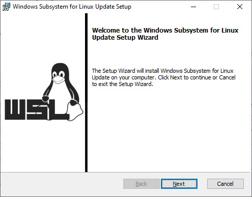

# Passo 1:

Faça do download do Docker Desktop em: https://docs.docker.com/desktop/windows/install/

# Passo 2:

Instalação do Docker Desktop


Após o Docker instalado, é necessário reiniciar o Windows.

# Passo 3:

Com o Docker instalado, devemos agora instalar o WSL 2





# Passo 4:

Configuração do Docker Compose.

```yml
version: '3'
services:

  jupyter-notebook:
    image: jupyter/all-spark-notebook
    ports:
      - "8888:8888"
      - "4040:4040"
    volumes:
      - ./work/:/home/jovyan/work

```

Docker Compose é o orquestrador de containers da Docker, é escrito em YAML (acrônimo recursivo para YAML Ain’t Markup
Language) é um formato de codificação de dados legíveis por humanos, o que torna fácil de ler e entender o que um
Compose faz!

No nosso caso, estamos rodando o Jupyter dentro de um container, então no nosso docker compose, configuramos o endereço
da imagem, a informação das portas e volume da nossa imagem.

Após o Docker Desktop baixado e o compose configurado, vamos até a pasta onde está nosso arquivo do docker compose e
executamos o seguinte comando:

<code>docker compose up -d</code>

Com esse comando baixamos a imagem do jupyter e após isso conseguimos acessar nosso ambiente já dentro do container!

# Passo 5

Para acessar o notebook, vamos precisar pegar o token no log do container.

Primeiro vamos rodar ```docker ps``` para ver os containers em execução.

```
CONTAINER ID   IMAGE                        COMMAND                  CREATED      STATUS                   PORTS                                            NAMES
8c62f2285646   jupyter/all-spark-notebook   "tini -g -- start-no…"   7 days ago   Up 4 minutes (healthy)   0.0.0.0:4040->4040/tcp, 0.0.0.0:8888->8888/tcp   matf42-trabalho-jupyter-notebook-1
```

E depois vamos abrir o log com o id do container, por exemplo: ```docker logs 8c62f2285646```, e procurar a mensagem com
o token de acesso.

```
[C 2022-06-15 20:24:36.053 ServerApp]

    To access the server, open this file in a browser:
        file:///home/jovyan/.local/share/jupyter/runtime/jpserver-7-open.html
    Or copy and paste one of these URLs:
        http://8c62f2285646:8888/lab?token=f6e577f57bc1c3d4a6e59bb0ad8d8bce9f746a71a497ba58
     or http://127.0.0.1:8888/lab?token=f6e577f57bc1c3d4a6e59bb0ad8d8bce9f746a71a497ba58
[I 2022-06-15 20:25:02.743 LabApp] Build is up to date
```

Então podemos clicar no link, ou copiar e colar no navegador, para abrir o jupyter.


