```{r setup, include=FALSE}
library(knitr)
library(rmdformats)
library(formatR)
## Global options
options(max.print="75")
opts_chunk$set(echo=TRUE,
	             cache=TRUE,
               prompt=FALSE,
               tidy=TRUE,
               comment=NA,
               message=FALSE,
               warning=FALSE)
opts_knit$set(width=75)
```

# Requisitos para o Tutorial

Sua máquina Windows deve atender aos seguintes requisitos para instalar o Docker Desktop com êxito:

## Requisitos do sistema {.tabset .tabset-fade .tabset-pills}

### WSL 2 backend

* Windows 11 64-bit: Pro versão 21H2 ou superior, ou Enterprise ou Education verssão 21H2 ou superior.
* Windows 10 64-bit: Home ou Pro 21H1 (build 19043) ou superior, ou Enterprise ou Education 20H2 (build 19042) ou superior.
* Habilitado o recurso WSL 2 no Windows. Para obter instruções detalhadas, consulte [Microsoft documentation](https://docs.microsoft.com/en-us/windows/wsl/install).
* Os seguintes pré-requisitos de hardware são necessários para executar com êxito o WSL 2 no Windows 10 ou Windows 11:
  - processador 64-bit com Tradução de Endereço de segundo nível (SLAT)
  - 4GB RAM
  - Suporte à virtualização de hardware no nível da BIOS, deve ser ativado nas configurações da BIOS. Para mais informações acesse [Virtualization](https://docs.docker.com/desktop/windows/troubleshoot/#virtualization-must-be-enabled).
* Baixar e instalar o [Linux kernel update package](https://docs.microsoft.com/pt-br/windows/wsl/install-manual#step-4---download-the-linux-kernel-update-package).

### Hyper-V backend e Windows containers

* Windows 11 64-bit: Pro versão 21H2 ou superior, ou Enterprise ou Education verssão 21H2 ou superior.
* Windows 10 64-bit: Home ou Pro 21H1 (build 19043) ou superior, ou Enterprise ou Education 20H2 (build 19042) ou superior.

Para Windows 10 e Windows 11 Home, consulte os requisitos de sistema no **WSL 2 backend**.

* Os recursos do Hyper-V e Containers Windows devem estar habilitados.
* Os seguintes pré-requisitos de hardware são necessários para executar com êxito o Client Hyper-V no Windows 10:
  - processador 64-bit com Tradução de Endereço de segundo nível (SLAT)
  - 4GB RAM
  - Suporte à virtualização de hardware no nível da BIOS, deve ser ativado nas configurações da BIOS. Para mais informações acesse [Virtualization](https://docs.docker.com/desktop/windows/troubleshoot/#virtualization-must-be-enabled).

---

# Instalação do Docker Desktop

Passo 1: Faça do download do Docker Desktop em: 

* https://docs.docker.com/desktop/windows/install/

Clicando no link acima será iniciado o download do arquivo **Docker Desktop Installer.exe**, após o fim do download do arquivo execute-o para dá inicio a instalação.

Passo 2: Após iniciar a instalação do Docker será exibido a tela abaixo, clique em **OK** para dá inicio ao processo de instalação.

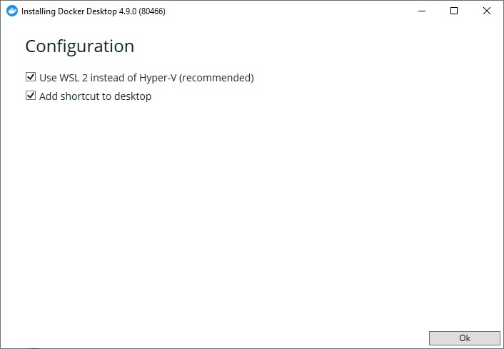

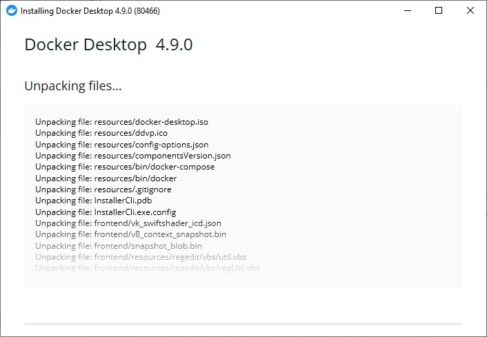

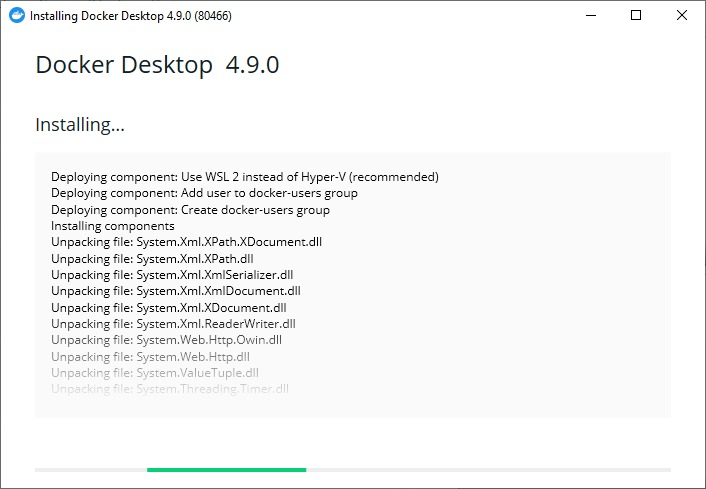

Clique no botão **Close and restart** para reiniciar o Windows e completar a instalação do Docker.

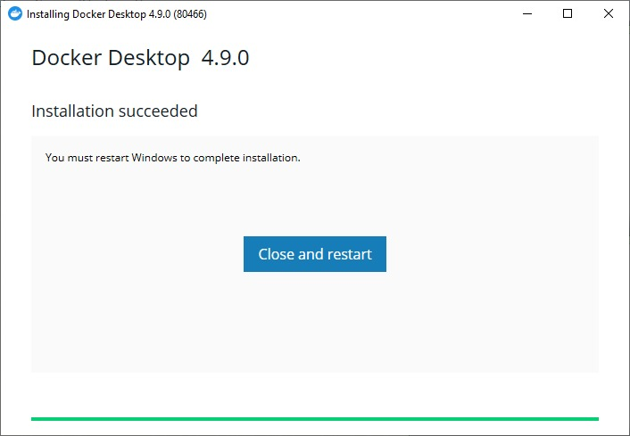

Na tela seguinte é preciso aceitar os termos selecionando a opção **I accept the terms** e clicar no botão **Accept**.

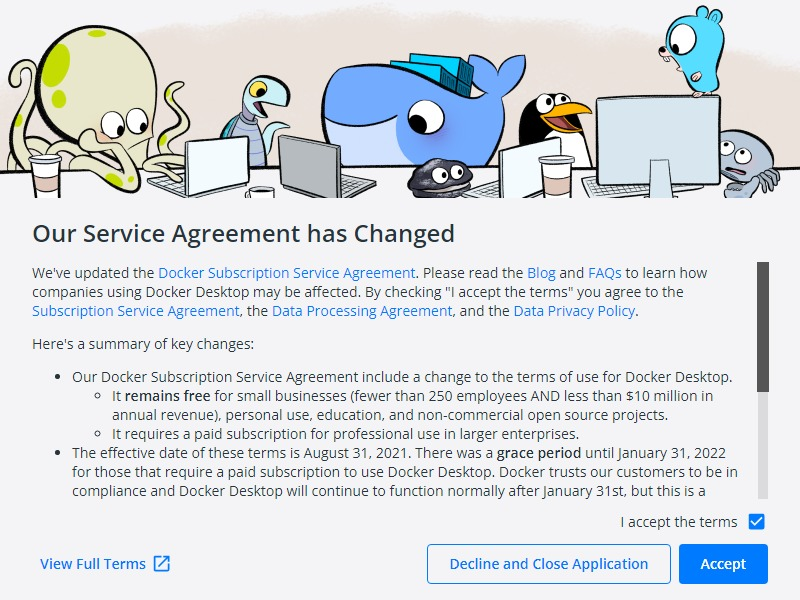
Após esse passo teremos nosso Docker Desktop instalado.

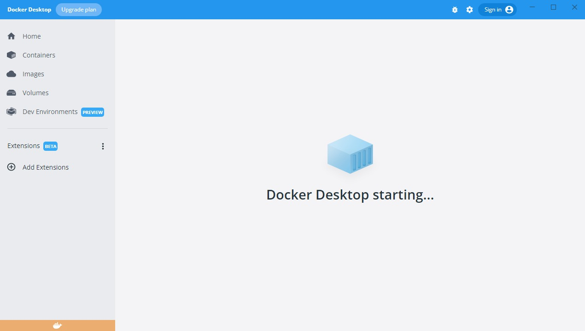
Passo 3: Após a instalação o Docker Desktop solicitará a instalação do WSL 2.

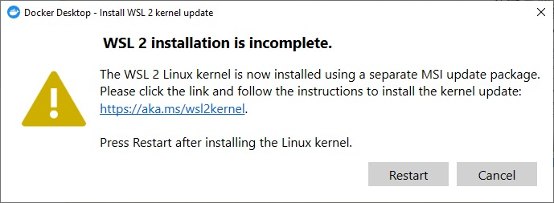

Basta clicar sempre em **Next** para proseguir com a instalação e ao final clicar em **Finish**.


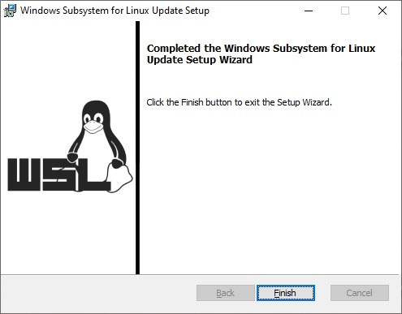
Após o Docker Desktop instalado, para testar se tudo ocorreu bem abra o terminal do Windows e execute o comando abaixo:

```
docker run -d -p 80:80 docker/getting-started
```

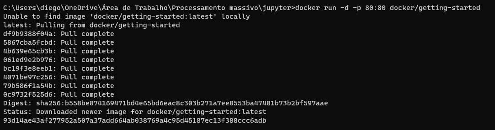


Após o finalizar o processo no terminal abra o navegador com o [link](http://localhost).

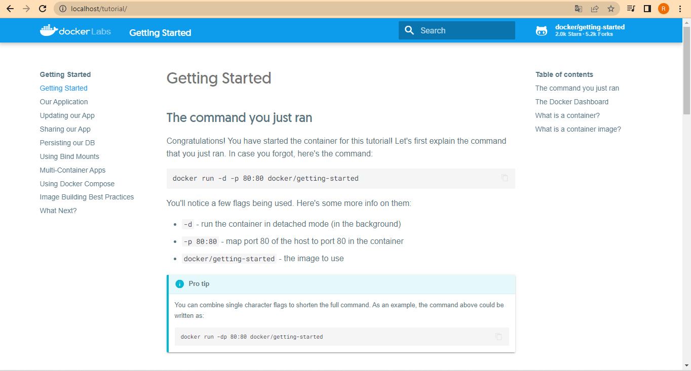

Caso tudo ocorra bem será apresentada a página **Getting Started** do Docker. 
Agora precisamos para o container usado para teste com os comandos abaixo.

Para verificar os container que está rodando execute o comando abaixo e pegue o **CONTAINER ID**.

````
docker ps
````

Com o conteiner id em mãos execute o comando abaixo para parar a execução do container.

```
docker stop CONTAIER_ID
```

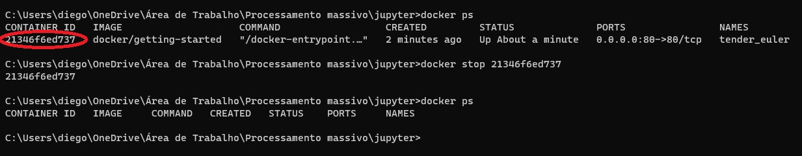

Passo 4: Configuração do Docker Compose.
É preciso criar o arquivo docker-compose.yml com o código abaixo. Crie uma diretório e coloque o arquivo docker-compose.yml dentro desse diretório.

```
version: '3'
services:
  jupyter-notebook:
    image: jupyter/all-spark-notebook
    ports:
      - "8888:8888"
      - "4040:4040"
    volumes:
      - ./work/:/home/jovyan/work
```

Docker Compose é o orquestrador de containers da Docker, é escrito em YAML (acrônimo recursivo para YAML Ain’t Markup Language) é um formato de codificação de dados legíveis por humanos, o que torna fácil de ler e entender o que um Compose faz!

No nosso caso, estamos rodando o Jupyter dentro de um container, então no nosso docker compose, configuramos o endereço da imagem, a informação das portas e volume da nossa imagem.

Após o Docker Desktop baixado e o compose configurado, vamos até a pasta onde está nosso arquivo do docker-compose e executamos o seguinte comando:

```
docker-compose up
```

Com esse comando baixamos a imagem do jupyter e inicializamos nosso container, após isso conseguimos acessar nosso ambiente já dentro do container através do que é apresentado no fim lá do terminal.


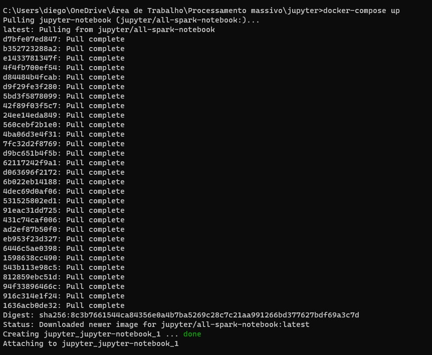
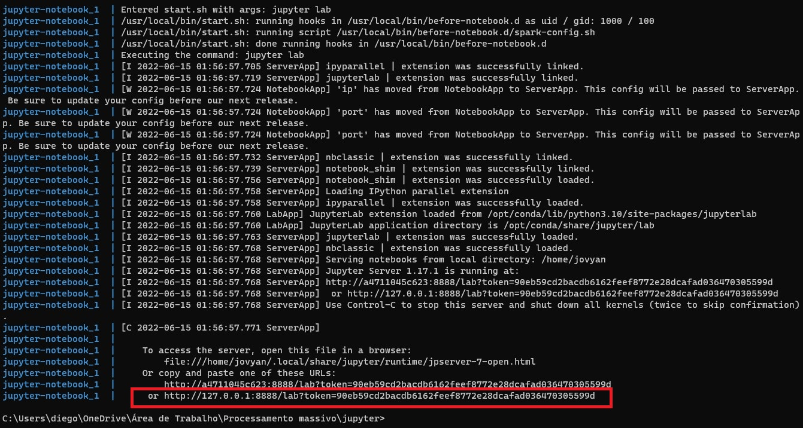

Acessando o link acima teremos a seguinte página do Jupyter.

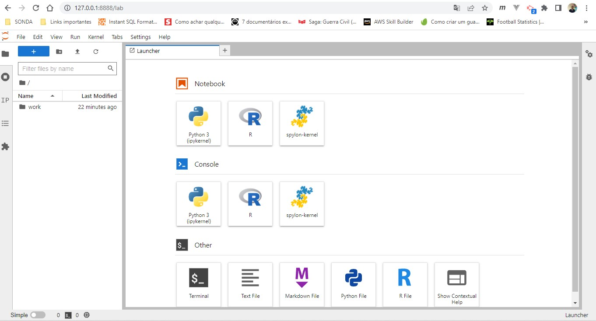

# Utilização do Scala no Jupyter


# Referências

Documentação Docker: https://docs.docker.com/desktop/windows/install/

Documentação Docker: https://docs.docker.com/desktop/windows/troubleshoot/#virtualization-must-be-enabled

Documentação Microsoft: https://docs.microsoft.com/en-us/windows/wsl/install

Documentação Microsoft: https://docs.microsoft.com/pt-br/windows/wsl/install-manual#step-4---download-the-linux-kernel-update-package